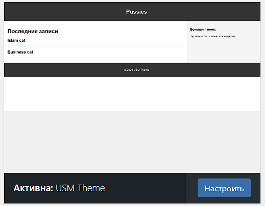
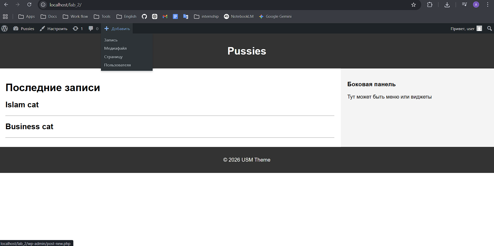

# Отчет по лабораторной работе №3
## Тема: Разработка простой темы WordPress
### Выполнил: Алексеев Сергей, IA-2303
---

## 📌 Цель работы

Изучить процесс создания собственной темы WordPress, освоить минимальную структуру темы и принципы работы шаблонов.

---

## 📋 Формулировка задачи

Необходимо разработать простую тему WordPress, включающую базовые шаблоны (index, single, page), подключение стилей, разбиение на части (header, footer, sidebar), а также обеспечить корректное отображение записей и страниц.

---

## 🧩 Теоретическая часть

WordPress использует шаблонную иерархию файлов для отображения контента. Основными элементами темы являются:

* `style.css` — содержит информацию о теме и стили
* `index.php` — основной шаблон
* `functions.php` — файл для подключения функциональности
* дополнительные шаблоны (`single.php`, `page.php`, `archive.php`)

WordPress использует **Loop (цикл)** для вывода записей:

```php
if (have_posts()) :
    while (have_posts()) : the_post();
        the_title();
    endwhile;
endif;
```

---

## ⚙️ Практическая часть

### 🔹 Шаг 1. Подготовка среды

* Установлен локальный сервер (OpenServer/XAMPP)
* Установлен WordPress
* Создана папка темы:
  `wp-content/themes/usm-theme`
* Включен режим отладки:

```php
define('WP_DEBUG', true);
```

---

### 🔹 Шаг 2. Создание обязательных файлов

Созданы файлы:

#### ✔ style.css

Содержит метаданные темы и базовые стили:

```css
/*
Theme Name: USM Theme
Author: Sergey
Version: 1.0
*/
```

#### ✔ index.php

Основной шаблон с выводом записей:

```php
<?php get_header(); ?>

<?php if (have_posts()) : ?>
    <?php while (have_posts()) : the_post(); ?>
        <h2><?php the_title(); ?></h2>
        <p><?php the_excerpt(); ?></p>
    <?php endwhile; ?>
<?php else : ?>
    <p>Нет записей</p>
<?php endif; ?>

<?php get_footer(); ?>
```

---

### 🔹 Шаг 3. Общие части шаблонов

Созданы файлы:

* `header.php` — шапка сайта
* `footer.php` — подвал сайта
* `sidebar.php` — боковая панель

Подключение выполнено через функции:

```php
get_header();
get_footer();
get_sidebar();
```

---

### 🔹 Шаг 4. Файл functions.php

Создан файл для подключения стилей:

```php
function usm_theme_styles() {
    wp_enqueue_style('main-style', get_stylesheet_uri());
}
add_action('wp_enqueue_scripts', 'usm_theme_styles');
```

---

### 🔹 Шаг 5. Дополнительные шаблоны

Реализованы:

* `single.php` — отображение одного поста
* `page.php` — отображение страницы
* `comments.php` — комментарии
* `archive.php` — архив записей

Подключение комментариев:

```php
comments_template();
```

---

### 🔹 Шаг 6. Стилизация темы

Добавлены стили для:

* шапки
* подвала
* контента
* боковой панели

Использован простой CSS для визуального разделения блоков.

---

### 🔹 Шаг 7. Скриншот темы

Создан файл:

```
screenshot.png
```

Размер:

```
1200x900 px
```

Используется для отображения темы в админ-панели WordPress.



---

### 🔹 Шаг 8. Активация темы

Тема активирована через:

```
Appearance → Themes
```

После активации проверена корректность отображения:

* главной страницы
* постов
* страниц

---

## 💡 Особенности реализации

* Реализован собственный цикл WordPress
* Ограничение вывода до 5 записей
* Разделение шаблонов на логические части
* Подключение стилей через functions.php (правильный способ)
* Добавлена боковая панель

---

## 📊 Вывод

В ходе работы была создана собственная тема WordPress с базовой структурой.
Изучены принципы работы шаблонов, подключение стилей и организация вывода данных через цикл WordPress.

🔗 Ссылка на репозиторий: *(вставь свою ссылку сюда)*

---

## ❓ Ответы на контрольные вопросы

### 1. Какие два файла обязательны?

* `style.css`
* `index.php`

---

### 2. Как подключаются части шаблонов?

С помощью функций:

```php
get_header();
get_footer();
get_sidebar();
```

---

### 3. Чем отличаются index.php, single.php и page.php?

* `index.php` — основной шаблон (главная страница)
* `single.php` — отображает отдельный пост
* `page.php` — отображает статические страницы

---

### 4. Зачем нужен functions.php?

Файл используется для:

* подключения стилей и скриптов
* добавления функциональности темы
* регистрации меню и виджетов

---

## 📚 Список использованных источников

1. https://developer.wordpress.org/themes/
2. https://wordpress.org/documentation/
3. Учебные материалы курса
4. StackOverflow
