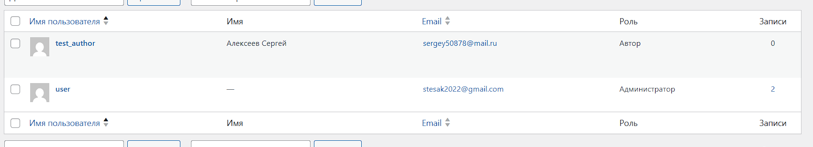
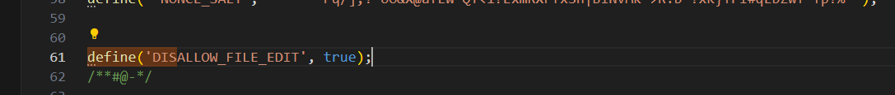
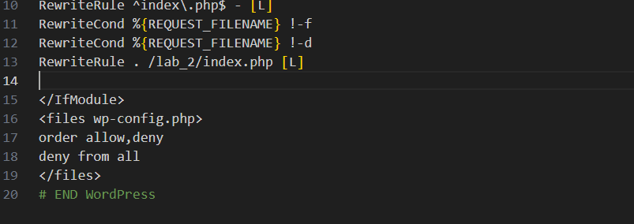
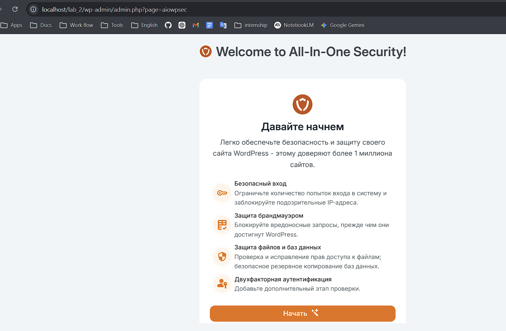
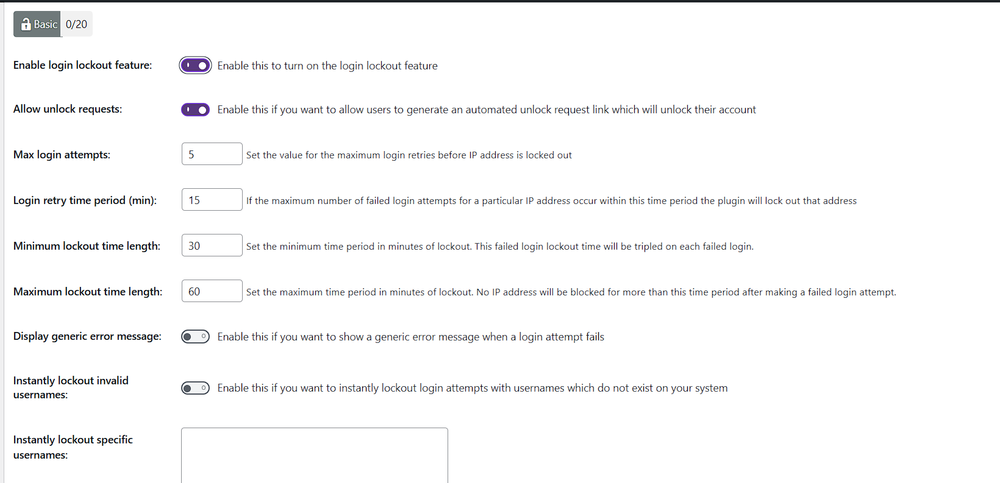
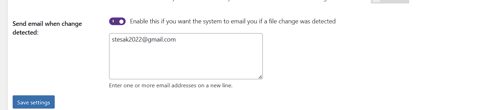

VcooxHqjoKZ6uFq3YowTd*un


1. Создайте тестового пользователя c ролью Автор (для дальнейших проверок).


Проверьте, что у каждого администратора включены сложные пароли (8+ символов, буквы/цифры/символы).

## Шаг 3. Обновления ядра, тем и плагинов
Проверьте наличие обновлений для WordPress, тем и плагинов.
Обновите всё до последних версий.
Настройте автоматические обновления для тем и плагинов.
Проверьте, что все обновления прошли успешно и сайт работает корректно.


## Шаг 4. Базовое hardening
1. Запретите редактирование файлов из админки, добавив в wp-config.php: php define('DISALLOW_FILE_EDIT', true);

2. Настройте верные права на файлы и папки:
Folders: 755
Files: 644
3. Защитите wp-config.php, добавив в .htaccess: <files wp-config.php> order allow,deny deny from all </files>


### Шаг 5. Установка и первичная настройка All In One WP Security & Firewall (AIOS)


Настройки:







## 🔹 Шаг 6. Проверка защиты от брутфорса

Для проверки защиты от перебора паролей был выполнен следующий сценарий:

1. Выполнен выход из административной панели WordPress.
2. Открыто окно браузера в режиме инкогнито.
3. Использован изменённый URL страницы входа:

   ```
   http://localhost/login-secure123
   ```
4. Введены неверные учетные данные (логин и пароль) более 5 раз подряд.

### 📊 Результат:

* После превышения допустимого количества попыток входа система автоматически заблокировала доступ.
* При попытке входа появилось сообщение о блокировке (Lockdown).
* Доступ к форме входа был временно ограничен.

### 🔍 Проверка логов:

В административной панели WordPress выполнен переход:

```
WP Security → Dashboard → Logs
```

Обнаружена запись:

* IP-адрес был добавлен в список заблокированных
* Указано время блокировки
* Причина: превышение количества попыток входа

### 🔓 Разблокировка:

Тестовый IP-адрес был удалён из списка блокировок через интерфейс плагина.

---

## 🔹 Шаг 7. Восстановление из резервной копии

Для проверки механизма восстановления выполнены следующие действия:

### 🧪 Подготовка:

1. Удалена одна тестовая запись (post).
2. Удалено одно изображение из медиабиблиотеки.

---

### 🔄 Восстановление:

1. Перейдено в раздел резервных копий (AIOS → Database Backup).
2. Выполнен импорт ранее сохранённого SQL-файла базы данных.

---

### 📊 Результат:

* Удалённая запись была успешно восстановлена.
* Изображение снова появилось в медиабиблиотеке.
* Связи между записями и медиафайлами сохранены.

---

### ✅ Проверка целостности:

* Контент отображается корректно
* Ошибок в базе данных не обнаружено
* Сайт функционирует стабильно

---

## 📌 Вывод по шагам 6–7

Проверка показала, что:

* Механизм защиты от брутфорса эффективно предотвращает несанкционированный доступ
* Система резервного копирования позволяет быстро восстановить данные без потерь

Это подтверждает корректную настройку безопасности WordPress.


## ❓ Ответы на контрольные вопросы

---

### 1. Почему DISALLOW_FILE_EDIT и правильные права на wp-config.php уменьшают риск пост-эксплойта?

После успешного взлома злоумышленник обычно пытается закрепиться в системе, изменяя файлы сайта.

Директива:

```php
define('DISALLOW_FILE_EDIT', true);
```

запрещает редактирование файлов темы и плагинов через админ-панель. Это означает, что даже если злоумышленник получил доступ к админке, он не сможет внедрить вредоносный код напрямую через встроенный редактор.

Файл `wp-config.php` содержит критически важные данные (логин и пароль к базе данных).
Правильные права доступа (644) и запрет доступа через `.htaccess` предотвращают:

* чтение конфигурации
* изменение настроек
* утечку данных

Таким образом, эти меры ограничивают возможности злоумышленника после взлома (post-exploit), снижая ущерб.

---

### 2. Какие параметры Login Lockdown/Firewall выбраны и почему?

Были выбраны следующие параметры:

* Max Login Attempts: 5
* Login Retry Time Period: 15 минут
* Lockout Time: 30 минут

Обоснование:

* **5 попыток** — достаточное число для пользователя, чтобы не ошибиться случайно, но мало для перебора пароля.
* **15 минут** — ограничивает частоту атак, не создавая сильного неудобства.
* **30 минут блокировки** — делает brute-force атаки практически неэффективными.

Firewall:

* включена защита от XSS
* блокировка вредоносных запросов (Bad Query Strings)
* отключён directory browsing

Баланс:

* безопасность ↑ (защита от атак)
* UX ↓ минимально (обычный пользователь не заметит)

---

### 3. Различие уровней защиты

**Уровень WordPress (плагины, WAF):**

* работает на уровне приложения
* фильтрует запросы внутри WordPress
* защищает от XSS, SQL-инъекций, brute-force

**Уровень веб-сервера (Apache/Nginx):**

* обрабатывает HTTP-запросы
* может блокировать IP, ограничивать доступ к файлам
* быстрее, чем PHP-уровень

**Уровень ОС:**

* контроль прав доступа к файлам
* управление пользователями и процессами
* защита от прямого доступа к системе

Итог:
→ чем ниже уровень, тем выше базовая безопасность
→ чем выше уровень, тем гибче логика защиты

---

### 4. Что входит в полный бэкап WordPress и как проверить восстановление?

Полный бэкап включает:

1. **Базу данных (MySQL)**

   * записи
   * пользователи
   * настройки

2. **Файлы сайта (wp-content)**

   * темы
   * плагины
   * загрузки (media)

Проверка восстановления:

1. Удаляются данные (например, пост и изображение)
2. Выполняется восстановление базы данных
3. Проверяется:

   * восстановился ли контент
   * корректно ли отображается сайт
   * нет ли ошибок

Если всё восстановилось корректно → бэкап считается рабочим.

---

## 📌 Вывод

Комплексная защита WordPress строится на нескольких уровнях:

* ограничение доступа
* защита от атак
* резервное копирование

Это позволяет минимизировать риски и быстро восстановить сайт при необходимости.

